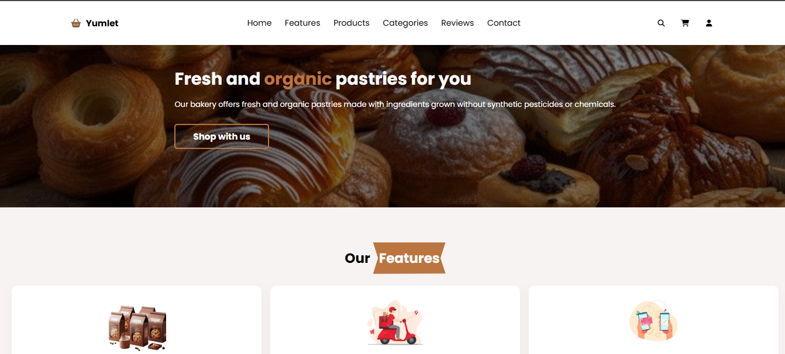

# 🍰 Yumlet Pastries

A simple and delicious **pastry website** built with **HTML, CSS, and JavaScript**.  
This project showcases a pastry shop’s offerings with a sweet and responsive design.

---

## ✨ Features
- 📱  **Responsive Design** — works on desktop and mobile.  
- 🥖 **Interactive UI** — smooth animations and transitions with vanilla JavaScript.  
- 🍩 **Pastry Showcase** — highlight pastries with images and descriptions.  
- ☕ **Contact Section** — simple form for users to reach out.  

---

## 🚀 Tech Stack
- **HTML5** — semantic structure  
- **CSS3** — styling, animations, responsiveness  
- **JavaScript (ES6+)** — interactivity  

---

## 📂 Project Structure

├── index.html
├── /css
│ └── style.css
├── /js
│ └── script.js
└── /images
└── (pastry images)

---

## 📸 Screenshots

